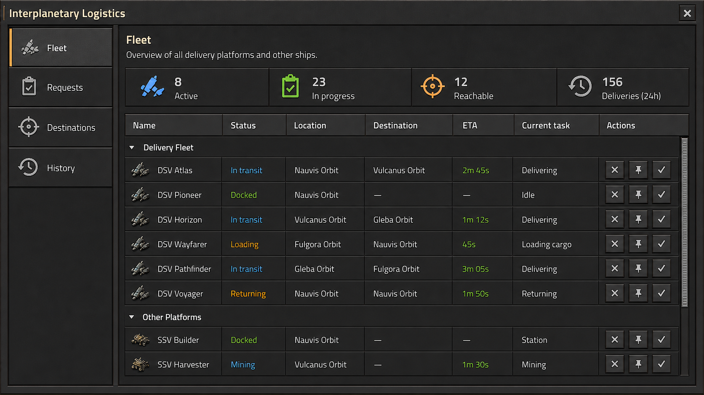
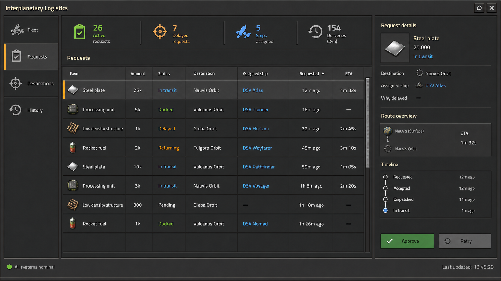
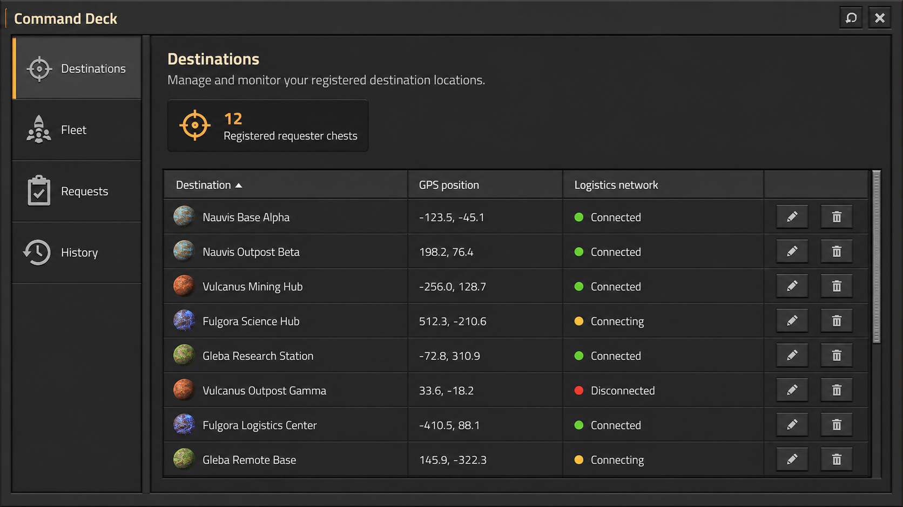
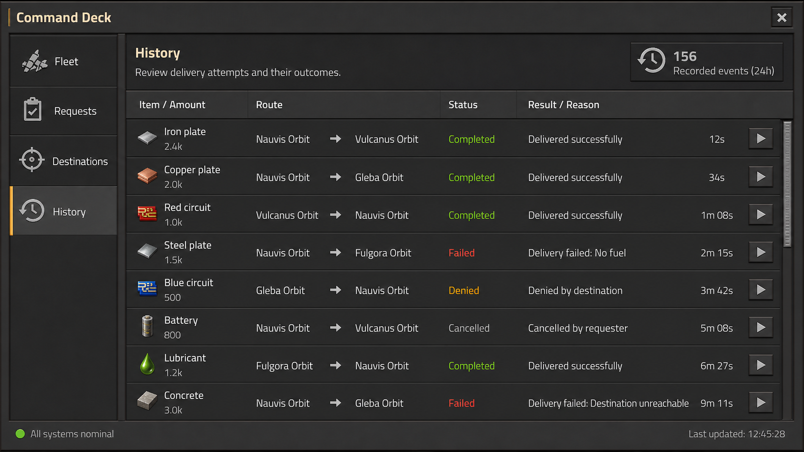

# Interplanetary Logistics

[](https://www.factorio.com/)
[](https://www.factorio.com/space-age/content)


**Turn local logistics shortages into automated deliveries between planets.**

Interplanetary Logistics extends Factorio's requester workflow across the solar system. It detects items that cannot be supplied locally, finds stock on another planet, assigns an eligible space platform, and manages the temporary pickup and delivery stops needed to complete the transfer.

Permanent platform schedules are never replaced or rewritten.



## Highlights

- **Local-first requests** — standard logistic robots get the first opportunity to satisfy each requester chest.
- **Automated interplanetary routing** — unresolved shortages are matched with available stock and an eligible enrolled platform.
- **Construction support** — construction alerts are aggregated into destination-specific material requests.
- **Human-in-the-loop controls** — approve, deny, retry, or prioritize requests from the dashboard; untouched requests can auto-approve.
- **Fleet-aware dispatching** — platforms are ranked by route preference and earliest arrival, while sources are ranked by stock coverage and historical reliability.
- **Safe scheduling** — only temporary records are added to platform schedules, then removed after delivery or failure.
- **Reservation-aware transfers** — source inventory is reserved so concurrent requests cannot claim the same surplus.
- **Native Factorio interface** — responsive dashboards, compact list views, clear status states, tooltips, and useful empty states.

## How it works

```text
Local shortage
      │
      ▼
Request created ──► approval ──► source selected ──► platform assigned
                                                            │
                                                            ▼
                                               pickup ──► delivery ──► cleanup
```

1. The mod scans Interplanetary Requester Chests and construction alerts.
2. Any shortage left after local logistics is published as a trade request.
3. Approved requests are matched with a source that can cover the shipment while preserving its configured reserve.
4. An enrolled platform whose permanent route includes both planets receives temporary pickup and delivery stops.
5. After the transfer finishes—or fails—the temporary stops, reservations, and isolated logistic sections are cleaned up.

## Dashboard

Open the dashboard from the shortcut bar or press <kbd>Alt</kbd> + <kbd>I</kbd>.

| View | Purpose |
| --- | --- |
| **Fleet Monitor** | See Delivery Fleet and Other Platforms, current work, status, route, destination, and ETA. |
| **Requests** | Review active and attention-needed shortages, change priority, and approve, deny, or retry dispatches. |
| **Destinations** | Inspect registered requester chests, their planets, positions, and logistic-network connectivity. |
| **History** | Review recent dispatch decisions and delivery outcomes. |

<details>
<summary><strong>View more dashboard screens</strong></summary>

### Requests



### Destinations



### History



</details>

## Requirements

- Factorio **2.0** or newer
- Space Age expansion **2.0** or newer

## Installation

### Factorio mod directory

1. Download or clone this repository.
2. Place it in your Factorio `mods` directory as `interplanetary-logistics_0.1.0`, or package that folder as `interplanetary-logistics_0.1.0.zip`.
3. Enable **Interplanetary Logistics** in Factorio's **Mods** menu.
4. Start or load a Space Age game.

Typical mod directory locations:

| Platform | Path |
| --- | --- |
| Windows | `%APPDATA%\Factorio\mods` |
| Linux | `~/.factorio/mods` |
| macOS | `~/Library/Application Support/factorio/mods` |

## Quick start

1. Craft and place an **Interplanetary Requester Chest**.
2. Configure its requester slots normally.
3. Connect it to a logistic network shared with a cargo landing pad.
4. Open the dashboard with the shortcut bar button or <kbd>Alt</kbd> + <kbd>I</kbd>.
5. Enroll the space platforms that the network may use for deliveries.
6. Ensure each enrolled platform's permanent schedule includes the intended source and destination planets.
7. Optionally pin a preferred platform, require a circuit-ready signal, or adjust request priorities.

> [!IMPORTANT]
> A platform is eligible only when explicitly enrolled and its existing permanent route contains both the source and destination planets.

## Configuration

Settings are available under **Settings → Mod settings → Map**.

| Setting | Default | Description |
| --- | ---: | --- |
| Auto-approve delay | 30 seconds | Time before an untouched request is approved automatically. Set to `0` for immediate approval. |
| Network scan interval | 120 ticks | Interval between requester chest, construction alert, and transfer scans. |
| Source planet reserve | 0 items | Amount that must remain available in every candidate source network. |
| Require ready signal | Off | Makes temporary pickup stops wait for a configured virtual signal as well as the requested cargo. |
| Ready virtual signal | Green signal | Signal used to release a platform from a temporary pickup stop. |

Requests support **low**, **normal**, and **high** dispatch priority. A platform may also be pinned as the preferred ship for every source/destination pair in its permanent route.

## Design guarantees

- Permanent platform schedule records are never mutated.
- Existing onboard cargo is preserved as return cargo; only the requested quantity is unloaded.
- Denied requests remain available for review and are not raised repeatedly.
- Automatic and manual refreshes preserve the current dashboard view, selected request, and scroll position.
- Delivery Fleet and Other Platforms remain separate and are sorted by ship name.
- Routing decisions use deterministic ordering for multiplayer safety.

## Development

The mod targets Factorio's modified Lua 5.2 runtime. Runtime modules live in `scripts/`; tests use lightweight Factorio API mocks and run in plain Lua.

```shell
lua tests/runtime_spec.lua
lua tests/data_stage_spec.lua
python tests/locale_spec.py
```

All three checks should finish with an `OK` result.

## Project structure

```text
├── control.lua          Runtime entry point and event registration
├── data.lua             Prototypes and native GUI styles
├── settings.lua         Runtime-global mod settings
├── scripts/             Demand, routing, platform, state, and GUI modules
├── locale/en/           English names, descriptions, and interface text
├── mockups/             Dashboard reference images
└── tests/               Runtime, data-stage, and locale checks
```

## Contributing

Issues and merge requests are welcome. When proposing a change:

1. Keep runtime code compatible with Factorio 2.0 and Lua 5.2.
2. Add or update tests for behavior changes.
3. Run the complete verification suite before submitting the change.

---

Built for factories whose logistics network no longer fits on one planet.
